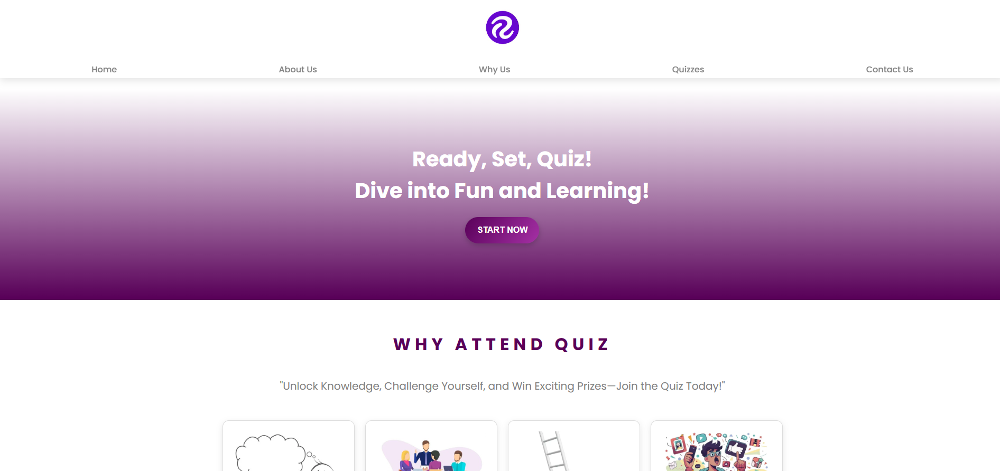
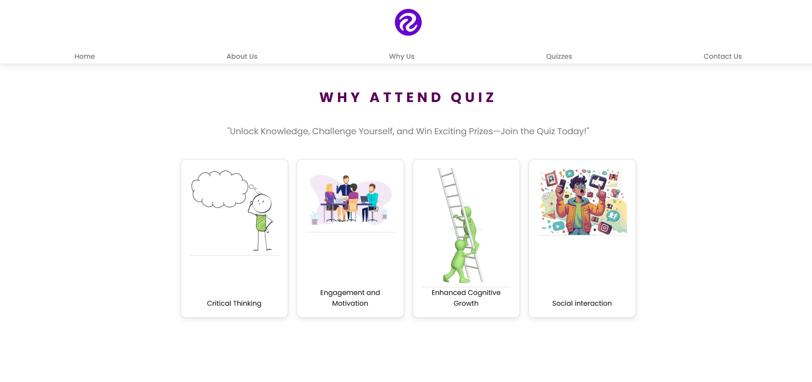
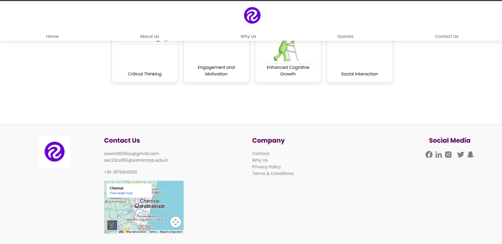
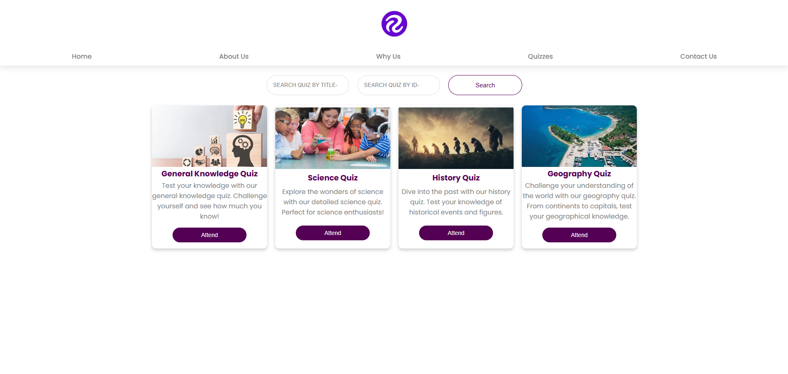
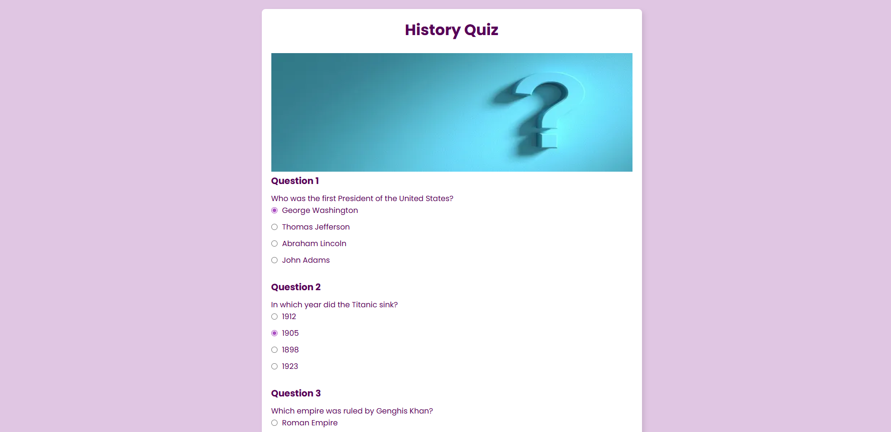
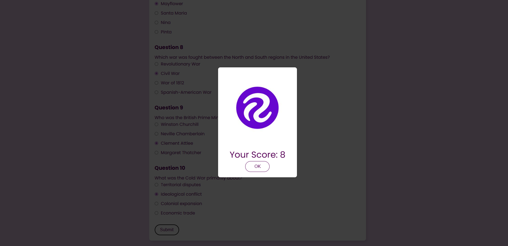

# 🎯 QuizApp - Interactive Learning Platform

[](https://opensource.org/licenses/ISC)
[](https://nodejs.org/)
[](https://www.mongodb.com/)

> **Ready, Set, Quiz!** Dive into fun and learning with our interactive quiz platform. Challenge yourself, test your knowledge, and compete with others!


## 🌟 Features

- 🔐 **Secure Authentication** - User registration and login with bcrypt password hashing
- 📊 **Interactive Quizzes** - Multiple choice questions with instant feedback
- 🎨 **Beautiful UI** - Modern, responsive design with smooth animations
- 📱 **Mobile Responsive** - Works seamlessly on all devices
- 🏆 **Score Tracking** - Monitor your progress and achievements
- 📧 **Contact System** - Built-in contact form for user feedback
- 🎭 **Animations** - Smooth AOS (Animate On Scroll) animations
- 🔒 **Privacy Protected** - Secure data handling and privacy policies

## 🏗️ Project Architecture

```
┌─────────────────────────────────────────────────────────────┐
│                        Frontend Layer                       │
├─────────────────┬─────────────────┬─────────────────────────┤
│   index.html    │   home.html     │      quiz.html          │
│  (Authentication│   (Dashboard)   │    (Quiz Engine)        │
│   & Login)      │                 │                         │
├─────────────────┼─────────────────┼─────────────────────────┤
│   check.html    │  contact.html   │   quiz-details.html     │
│   (Validation)  │   (Contact)     │   (Quiz Details)        │
└─────────────────┴─────────────────┴─────────────────────────┘
                            │
                            ▼
┌─────────────────────────────────────────────────────────────┐
│                       Backend Layer                         │
├─────────────────────────────────────────────────────────────┤
│                   Express.js Server                         │
│  ┌─────────────┐ ┌─────────────┐ ┌─────────────────────────┐│
│  │ User Auth   │ │ Quiz API    │ │    Contact Form         ││
│  │ Endpoints   │ │ Endpoints   │ │    Endpoints            ││
│  └─────────────┘ └─────────────┘ └─────────────────────────┘│
└─────────────────────────────────────────────────────────────┘
                            │
                            ▼
┌─────────────────────────────────────────────────────────────┐
│                      Database Layer                         │
├─────────────────────────────────────────────────────────────┤
│                    MongoDB Atlas                            │
│  ┌─────────────┐ ┌─────────────┐ ┌─────────────────────────┐│
│  │ Users       │ │ Quizzes     │ │    Contact Messages     ││
│  │ Collection  │ │ Collection  │ │    Collection           ││
│  └─────────────┘ └─────────────┘ └─────────────────────────┘│
└─────────────────────────────────────────────────────────────┘
```

## 🛠️ Technology Stack

### Frontend
- **HTML5** - Semantic markup and structure
- **CSS3** - Modern styling with Flexbox and Grid
- **JavaScript (ES6+)** - Interactive functionality
- **Font Awesome** - Icon library
- **Boxicons** - Additional icon set
- **AOS** - Animate On Scroll library

### Backend
- **Node.js** - Runtime environment
- **Express.js** - Web application framework
- **MongoDB** - NoSQL database
- **Mongoose** - MongoDB object modeling
- **bcrypt** - Password hashing
- **CORS** - Cross-origin resource sharing

### Development Tools
- **npm** - Package management
- **Git** - Version control
- **VS Code** - Code editor

## 🚀 Getting Started

### Prerequisites

- Node.js (v14 or higher)
- MongoDB (local installation or MongoDB Atlas)
- npm or yarn package manager

### Installation

1. **Clone the repository**
   ```bash
   git clone <repository-url>
   cd quizapp
   ```

2. **Install backend dependencies**
   ```bash
   cd node
   npm install
   ```

3. **Set up MongoDB**
   - Install MongoDB locally, OR
   - Create a MongoDB Atlas account and get your connection string

4. **Configure environment**
   - Update the MongoDB connection string in `server.js` if needed

5. **Start the server**
   ```bash
   cd node
   node server.js
   ```

6. **Access the application**
   - Open your browser and navigate to `http://localhost:5000`

## 📁 Project Structure

```
quizapp/
├── 📄 index.html              # Login/Registration page
├── 📄 home.html               # Main dashboard
├── 📄 quiz.html               # Quiz interface
├── 📄 quiz-details.html       # Quiz details page
├── 📄 check.html              # Email validation page
├── 📄 contact.html            # Contact page
├── 📄 whyus.json             # Features data
├── 📄 quizcard.json          # Quiz cards data
├── 📁 css/
│   ├── 📄 index.css          # Login page styles
│   ├── 📄 home.css           # Dashboard styles
│   ├── 📄 quiz.css           # Quiz interface styles
│   └── 📄 quiz-details.css   # Quiz details styles
└── 📁 node/
    ├── 📄 server.js          # Express server
    ├── 📄 package.json       # Dependencies
    ├── 📄 package-lock.json  # Lock file
    └── 📄 insertData.js      # Data insertion script
```

## 🔌 API Endpoints

### Authentication
- `POST /create-user` - Register a new user
- `POST /signin` - User login
- `GET /check-email/:email` - Check if email exists

### Quizzes
- `GET /quiz/:id` - Get quiz by ID

### Contact
- `POST /contact-form` - Submit contact form

### Static Files
- `GET /home` - Serve home page
- `GET /` - Serve index page

## 🎮 User Flow Diagram

```
┌─────────────┐
│  Landing    │
│ (index.html)│
└──────┬──────┘
       │
       ▼
┌─────────────┐    ┌─────────────┐
│  Sign Up    │    │  Sign In    │
│             │    │             │
└──────┬──────┘    └──────┬──────┘
       │                  │
       ▼                  ▼
┌─────────────────────────────────────┐
│         Dashboard (home.html)       │
└─────────────────┬───────────────────┘
                  │
        ┌─────────┼─────────┐
        │         │         │
        ▼         ▼         ▼
   ┌─────────┐ ┌───────┐ ┌─────────┐
   │ Quizzes │ │Why Us │ │Contact  │
   │         │ │       │ │         │
   └─────┬───┘ └───┬───┘ └─────┬───┘
         │         │           │
         ▼         ▼           ▼
   ┌─────────────────────────────────┐
   │     Quiz Interface (quiz.html)  │
   └─────────────────────────────────┘

```

## 📸 Application Screenshots & Flow

### 🔐 Authentication & Dashboard Flow

<div align="center">

#### Dashboard Screenshots

*Dashboard Overview - Main landing page with navigation*


*Dashboard Features - Interactive elements and quiz cards*


*Dashboard Details - Why Us section and footer information*

</div>

### 🎯 Quiz Flow Screenshots

<div align="center">

#### Quiz Interface Flow

*Quiz Selection - Available quizzes and categories*


*Quiz Engine - Interactive question interface*


*Results Page - Score display and performance metrics*

</div>

### 📱 User Journey

1. **Landing Page** → User authentication and registration
2. **Dashboard** → Overview of available features and quizzes
3. **Quiz Selection** → Browse and choose from available quizzes
4. **Quiz Interface** → Answer questions with interactive UI
5. **Results** → View scores, performance, and achievements

## 🎨 Design Features

- **Responsive Design** - Mobile-first approach
- **Dark Theme** - Modern dark color scheme
- **Smooth Animations** - AOS library for scroll animations
- **Interactive Elements** - Hover effects and transitions
- **Clean Typography** - Easy-to-read fonts and spacing
- **Accessibility** - Semantic HTML and ARIA labels

## 🧪 Testing

To test the application:

**Start the server**
   ```bash
   cd node
   node server.js
   ```

### Production Deployment
1. Set up MongoDB Atlas
2. Configure environment variables
3. Use PM2 for process management
4. Set up reverse proxy with Nginx

## 🤝 Contributing

1. Fork the repository
2. Create a feature branch (`git checkout -b feature/AmazingFeature`)
3. Commit your changes (`git commit -m 'Add some AmazingFeature'`)
4. Push to the branch (`git push origin feature/AmazingFeature`)
5. Open a Pull Request

## 👨‍💻 Author

**Aswin** - *Initial work* - [GitHub Profile](https://github.com/Aswin0526)

## 🙏 Acknowledgments

- Font Awesome for icons
- Boxicons for additional icons
- AOS library for animations
- MongoDB community
- Express.js team

## 📞 Support

For support, email:
- aswin0526as@gmail.com

Or reach out on [LinkedIn](https://www.linkedin.com/in/a-aswin/).

---

<div align="center">

**Made with ❤️ using web technologies**


</div>
